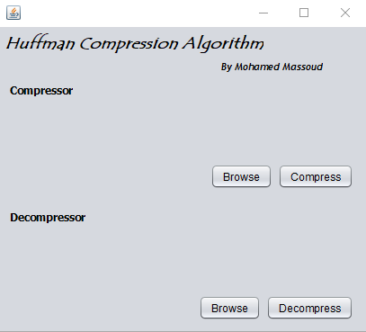
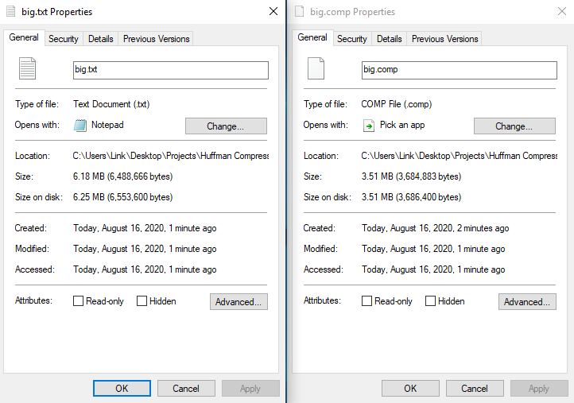

# HuffmanCompression
- This project is a demonstration of using the greedy approach to implement huffman compression algorithm.
- This program can only compress/decompress text files of any size.

**GUI**

**Results**

